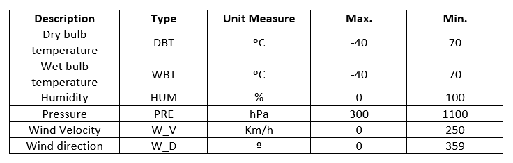
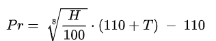

## Problem Brief

Sensor data should be monitored. To do this, it implemented a monitoring system with IoT-type devices.

The system is made up of two main parts. A data collection device and a data processing system. Each data collection device can be connected to a number of sensors such as those described in the table below. The processing system stores the information of each data collection device and the sensors that comprise it. At the same time, it interrogates the different data collection devices from time to time. When the data collection device receives the request, it interrogates all the sensors to collect the data. Communication is through public and / or private ethernet. The data is sent in JSON format.

Each data collection devices have an ID, description, display zone (an alphanumeric value) and location are known, formed by latitude and longitude coordinates. Each coordinate will be a real number.

Each device has a set of associated sensors type. Currently, the devices support a maximum of 256 sensors. Devices can have more than one sensor of the same type working.

Each sensor has an ID, a sensor type, a unit of measure, as well as the maximum and minimum ranges of the values of each sensor.

Initially the available sensors will be 6, whose technical characteristics are detailed below. More sensors may be incorporated in the future.



W_V and W_D was change to WiV and WiD

## Problems

Imagine that you are writing a device admin tool. Please complete the following tasks. Use the database schema and API documentation as a reference.

The config file from device is en `conf/conf.csv`. The data of each sensor that is connected to the device is in `conf/sensors.csv` 

1. Create a script that will consume data from the HTTP API endpoints described below and output sensor data to **stdout** in [JSON Lines format](https://jsonlines.org/). NOTE: You are **not** expected to create your own server backend. Although the data is mocked, use the provided endpoints as though they serve real data.

      Each line should contain:
    - The device data from config file.
    - An additional value, `date_time`, which contain the current date time in ISO 8601 UTC **date time** (i.e. "2021-09-06 17:01:07")
    - An additional value, `sensor_data`, which contain all data load from de sensors:
      Each `sensor_data` line should contain:
      - `id` sensor value as key.  
      - `type`, `value`, `unit` and `status`.
        The sensor `value` can be a real number between sensor range or `null` if there is any error.
        The sensor `status` will be: `OK` if data is between the sensor ranges, `NA` if sensor can't be read, `SE` if there are a sensor error or `OoR` if sensor data is out of range. 
2. Add a value, `calculated_data`, which contain all calculated data from de sensors. Those are a calculated values. In this exercise only calculate the dew point. See formula bellow. You can find the ids of sensor to combinate to make these calculations in `conf/sensor_to_calculate.csv` 
      
      Each line should contain:
      - `id` int number starting by 1000 as key.  
      - `type`: The type of calculate value. `DEW` in this exercise
      - `sensor_1_id` the id of the first sensor used to calculate it.
      - `sensor_2_id` the id of second sensor used to calculate it.
      - `value` the real value from calculate or `null` if there is an error in any sensor.
      - `unit` the unit of calculated data
      - `status` `OK` or `ERROR`

Note: all real number output must be a JSON Number.

## Simple HTTP API Service

This section details the kind of data objects and HTTP Service endpoints that provide access to them. Access each service endpoint using an **HTTP GET request**.

The call must be using the base http address plus the number of sensor that you're looking for. Sensor number is from sensors.csv file.

#### HTTP Base URL: https://my-json-server.typicode.com/VulturARG/test_exercice_01

##### Example sensor id: 0: https://my-json-server.typicode.com/VulturARG/test_exercice_01/0

### Sensor

* first (0 to 255 integer)
* second (0 to 255 integer)

```json
{
  "first": 4,
  "second": 26
}
```

- If `first` or `second`value have a value greater than `255` a `SE` error must be displayed.
- If `first` and `second`value are `255` a `SE` error must be displayed.

Calculate real value from sensor data:
`sensor_data = first * 256 + second`

- Temperature is in decimal celsius degree (ºC * 10). Valid range for positive temperature from 0 to 700. Negative temperature valid range from 1001 to 1400.
- Humidity is in decimal percent (% * 10). Valid range is 0 to 1000. Equivalent to 0% to 100%.
- Pressure is in decimal hPa (pressure * 10). Valid range is from 3000 to 11000. Equivalent to 300 hPa to 1100 hPa.
- Wind velocity is in centesimal part of kmh. (kmh * 100). Valid range is from 0 to 25000. Equivalent to 0 to 250 kmh.
- Wind direction is en degrees.

Example 1. Temp = 26ºC:
* `first = 1`
* `second = 4`
* `sensor_data = 1 * 256 + 4`
* `sensor_data = 260 = 26ºC`

Example 2. Temp = -5.4ºC:
* `first = 4`
* `second = 30`
* `sensor_data = 4 * 256 + 30`
* `sensor_data = 1054 = -5.4ºC`

Example 3. Humidity = 84.3%:
* `first = 3`
* `second = 75`
* `sensor_data = 3 * 256 + 75`
* `sensor_data = 840 = 84.3%`

Example 4. Pressure = 970.7 hPa:
* `first = 37`
* `second = 235`
* `sensor_data = 37 * 256 + 235`
* `sensor_data = 9707 = 970.7 hPa`

Example 5. Wind speed = 170.73 kmh:
* `first = 66`
* `second = 177`
* `sensor_data = 66 * 256 + 177`
* `sensor_data = 17073 = 170.73 kmh`

Example 6. Wing direction = 357º:
* `first = 1`
* `second = 101`
* `sensor_data = 1 * 256 + 101`
* `sensor_data = 357 = 357º`

### Dew point calculation

Dew point (Pr) simplificate method is: 


Where:
* H is humidity in %.
* T is temperature in celsius degree.
* Dew point unit is `ºC`

Example 1. Temp = 26ºC, Humidity = 84.3%:
* `Dew point = 23.1273708641822`
* `Round dew point = 23.1`

### Output examples

```json
{
    "status":"OK",
    "message":{
        "id":"125",
        "description":"Blue Valley",
        "lat":-39.157022213874725,
        "long":-66.79017668889016,
        "date_time":"2021-09-06 17:01:07",
        "sensor_data":{
            "0":{
                "type":"DBT",
                "value":27.3,
                "unit":"ºC",
                "status":"OK"
            },
            "1":{
                "type":"HUM",
                "value":57.7,
                "unit":"%",
                "status":"OK"
            },
            "2":{
                "type":"PRE",
                "value":null,
                "unit":"hPa",
                "status":"SE"
            }
        },
        "calculated_data" :{
            "1000" :{
                "type:":"DEW",
                "sensor_1_id":0,
                "sensor_2_id":1,
                "value":13.2,
                "unit":"ºC",
                "status":"OK"
            }
        }
    }
}
```

```json
{
    "status": "ERROR",
    "message": null
}
```

